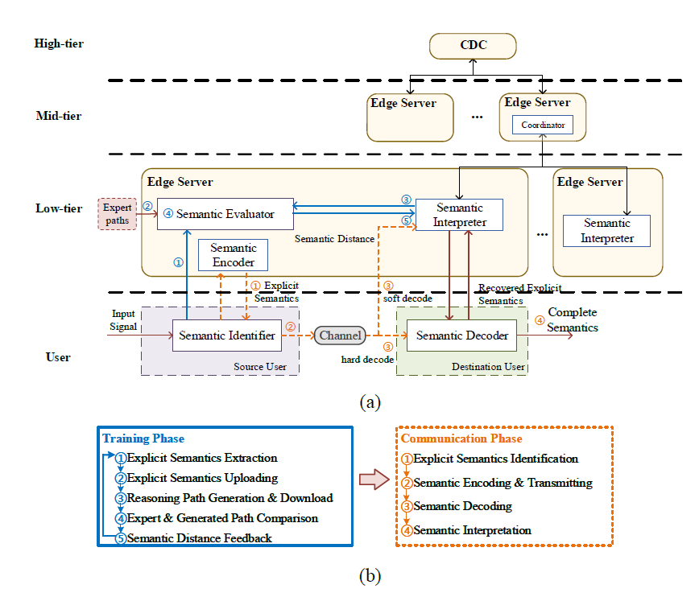

# iRML Semantic-aware Communication Networks
Codes for the paper **Imitation Learning-based Implicit Semantic-aware Communication Networks: Multi-layer Representation and Collaborative Reasoning** to be seen on *the IEEE Journal on Selected Areas in Communications*. 

We propose a novel reasoning-based implicit semantic-aware communication network architecture that allows multiple tiers of cloud data center (CDC) and edge servers to collaborate and support efficient semantic encoding, decoding, and interpretation for end-users. We introduce a new multi-layer representation of semantics taking into consideration both the hierarchical structure of implicit semantics as well as the personalized inference preference of individual users. We model the semantic reasoning process as a reinforcement learning process and then propose an imitation-based semantic reasoning mechanism learning (iRML) solution for the edge servers to leaning a reasoning policy that imitates the inference behavior of the source user. A federated graph convolutional networks (GCN)-based collaborative reasoning solution is proposed to allow multiple edge servers to jointly construct a shared semantic interpretation model based on decentralized knowledge bases.

